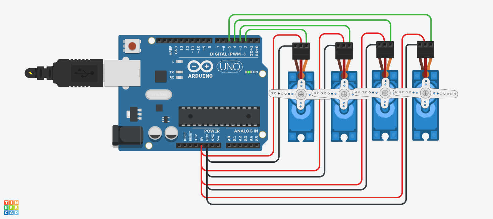

# 🤖 Arduino Humanoid Robot: 4 Servo Motors

This project is a **humanoid robot motion simulation** built using **Arduino UNO**, created in **Tinkercad**. It connects **4 servo motors** to Arduino, demonstrating basic servo control and walking motion algorithms in robotics.

---

## 🎯 Objectives

- Learn how to control multiple servo motors using Arduino.
- Implement the **Sweep motion** to test servo movement.
- Program servos to hold a fixed position (90°) after motion.
- Design a simple **walking algorithm** for a humanoid robot using servo coordination.

---

## 🪛 Components Used

| Quantity | Component      |
|----------|----------------|
| 1        | Arduino UNO    |
| 4        | Micro Servo Motors |
| 1        | Breadboard (optional for wiring clarity) |
| –        | Jumper Wires   |

---

## ⚙️ How the Circuit Works

- Each servo motor is connected to a digital pin on Arduino.
- All servos share **5V** and **GND**.
- The first part of the code runs a **Sweep motion** (back-and-forth) for 2 seconds.
- After that, all servos hold at **90°**, the neutral position.

| Servo | Arduino Pin | Function |
|-------|-------------|---------|
| Servo 1 | D2 | Right Hip / Front Leg |
| Servo 2 | D3 | Left Hip / Front Leg |
| Servo 3 | D4 | Right Leg / Lower Limb |
| Servo 4 | D5 | Left Leg / Lower Limb |

---

## 🧠 Arduino Code

```cpp
#include <Servo.h>

Servo servo1;
Servo servo2;
Servo servo3;
Servo servo4;

unsigned long startTime;

void setup() {
  servo1.attach(2);  
  servo2.attach(3);
  servo3.attach(4);
  servo4.attach(5);

  startTime = millis();  // Start time
}

void loop() {
  unsigned long elapsed = millis() - startTime;

  if (elapsed < 2000) {
    // Sweep motion for 2 seconds
    for (int pos = 0; pos <= 180; pos += 5) {
      servo1.write(pos);
      servo2.write(180 - pos);
      servo3.write(pos);
      servo4.write(180 - pos);
      delay(15);
    }
    for (int pos = 180; pos >= 0; pos -= 5) {
      servo1.write(pos);
      servo2.write(180 - pos);
      servo3.write(pos);
      servo4.write(180 - pos);
      delay(15);
    }
  } else {
    // Hold position at 90°
    servo1.write(90);
    servo2.write(90);
    servo3.write(90);
    servo4.write(90);
  }
}
```

---

## Walking Algorithm

**Steps for humanoid robot walking motion using 4 servos:**

1. **Initialization**:  
   Set all servos to **90°** (neutral standing).

2. **Right Leg Step**:  
   - Move right hip forward (**90° → 60°**)  
   - Lift right leg slightly (**90° → 70°**)

3. **Place Right Leg**:  
   - Lower right leg to **90°**  
   - Return right hip to **90°**

4. **Left Leg Step**:  
   - Move left hip forward (**90° → 120°**)  
   - Lift left leg slightly (**90° → 110°**)

5. **Place Left Leg**:  
   - Lower left leg to **90°**  
   - Return left hip to **90°**

6. **Repeat**:  
   Alternate steps for continuous walking.

> This algorithm can be implemented in Arduino code to simulate walking motion with coordinated servo movements.

---

## 🛠 Tools Used

- [Tinkercad](https://www.tinkercad.com) Circuits – For simulation and design.
- Arduino UNO – For coding and testing the circuit.
- Screenshot – Captured from the simulation.

---

## 📸 Screenshots




---

## ✨ What I Learned

- How to control multiple servo motors using Arduino.
- Implementing Sweep motion for testing servo range.
- Designing a simple walking motion algorithm for a humanoid robot.
- Using Tinkercad to simulate robotic movements before physical implementation.

---

## 📌 Notes

- The project was tested virtually using Tinkercad Circuits.
- Servo angles and timings can be adjusted for smoother or faster walking motion.
